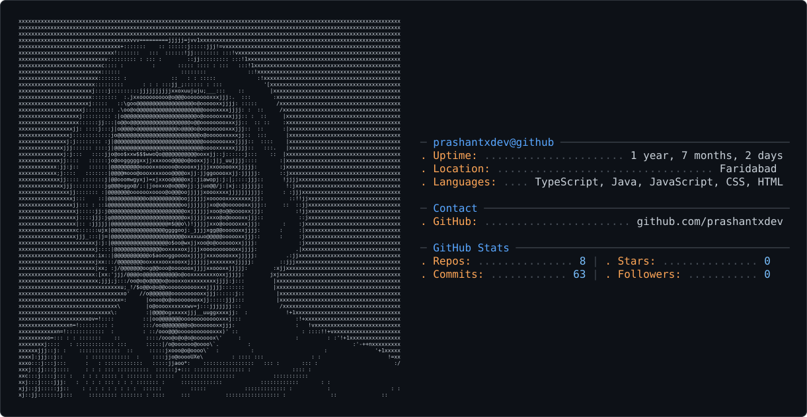

<picture>
  <source media="(prefers-color-scheme: dark)" srcset="dark_mode.svg" />
  <source media="(prefers-color-scheme: light)" srcset="light_mode.svg" />
  
</picture>

# Hi there 👋, I'm Prashant Kumar

### 💻 CS Undergrad @ GGSIPU | MERN Stack Developer | DSA (Java) | Hackathon Enthusiast

I'm passionate about problem-solving, building useful applications, and learning through hands-on projects. I enjoy turning ideas into real-world solutions and continuously improving my development skills.

---

## 🛠️ Tech Stack

### Languages

  
  
  
  
  
  
  
  

### Frontend

  
  
  

### Backend & Database

  
  
  
  
  
  
  

### Deployment & Cloud

  

### Tools

  
  
  
  
  
  

---

## 📊 GitHub Stats

  
  

---

## 🔥 Contribution Streak

  

---

## 🌐 Connect With Me

  
  
  

### 📫 Reach Me

**Email:** [kumarprashant8595@gmail.com](https://mail.google.com/mail/?view=cm&fs=1&to=kumarprashant8595@gmail.com)

---

### 💭 *"Build. Break. Learn. Repeat."*
